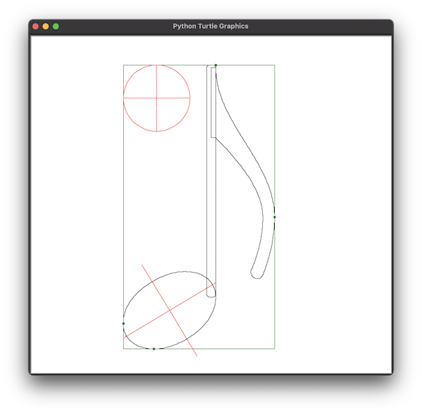

# Croche

Dessine une [croche](https://fr.wikipedia.org/wiki/Croche_(musique)) avec Turtle en Python.

Les dessins d'origine sont [Eighth_notes_and_rest](https://commons.wikimedia.org/wiki/File:Eighth_notes_and_rest.svg) et [Figure_rythmique_equivalence_croche_pointee](https://commons.wikimedia.org/wiki/File:Figure_rythmique_equivalence_croche_pointee.svg?uselang=fr).

